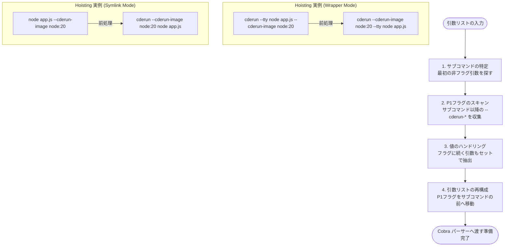

# 機能仕様：引数解析

## 概要

`cderun` はラッパーツールであり、自身のフラグと、コンテナ内で実行するコマンドへの引数を厳密に区別する。

## 基本構文

```text
cderun [cderun-flags] <subcommand> [passthrough-args]
```

- **[cderun-flags]**: `cderun` 自体の動作を制御するフラグ。サブコマンドの**前**に置く標準フラグ（P2）と、`--cderun-` で始まる内部オーバーライドフラグ（P1）に分けられる。
- **\<subcommand\>**: 最初の非フラグ引数。`.tools.yaml` から設定を読み込むための**キー**としてのみ使用される。コンテナの `CMD` には含まれない。
- **[passthrough-args]**: サブコマンド以降の全引数。コンテナ内で実行されるコマンドの引数として渡される。`--cderun-` フラグが含まれる場合は前方にホイストされる。

## イメージ名の決定

以下の優先順位で決定される。詳細は [引数・設定優先順位](./argument-priority-logic.md) を参照。

1. `--image` / `--cderun-image` フラグ (P1/P2)
2. `CDERUN_IMAGE` 環境変数 (P3)
3. `<subcommand>` をキーとして `.tools.yaml` から検索 (P4)
4. いずれも解決できない場合はエラー終了

## コンテナに渡されるコマンド

- `<subcommand>` はキーとして消費され、コンテナの `CMD` には含まれない
- コンテナの `CMD` は `[passthrough-args]` のみで構成される

### 例

```bash
# .tools.yaml に my-tool: {image: alpine, entrypoint: [/usr/bin/my-tool-impl]} がある場合
cderun my-tool -l -a
# → コンテナ内で /usr/bin/my-tool-impl -l -a が実行される

# --image で明示指定する場合
cderun --image=golang:1.22 --entrypoint=go go --version
# → コンテナ内で go --version が実行される（go はキーとして消費）

# イメージが特定できない場合
cderun go --version
# → エラー
```

## P1 内部オーバーライドのホイスト

`--cderun-` で始まるフラグは、内部オーバーライド（P1）として機能します。

標準の **Wrapper Mode** においては、`--cderun-` フラグは必ず**サブコマンドの後ろ**に配置する必要があります。サブコマンドの前に置くと、フラグの所有権の曖昧さを避けるためエラーとなります。

サブコマンドの後ろに置かれた `--cderun-` フラグは、前処理（`preprocessArgs`）によってサブコマンドの**前**に移動（ホイスト）され、`cderun` 自体の設定として解釈されます。

> **なぜサブコマンドの後ろなのか**: 標準フラグ（P2）をサブコマンドの前に、オーバーライドフラグ（P1）を後ろに配置するよう仕様を分けることで、ラップ対象のツールが持つ同名のフラグ（例: `node --env`）との所有権の曖昧さを完全に排除しています。もし P1 フラグをサブコマンドの前に置いた場合、それはエラーとして報告されます。

### ホイストの仕組み (Hoisting Mechanics)

`cderun` は実行時に引数リストをスキャンし、`--cderun-` プレフィックスを持つフラグを発見すると、それをサブコマンドの境界を越えて前方に移動させます（Hoisting）。これにより、Cobra などのコマンドラインパーサーがそれらを `cderun` コマンド自体のフラグ（P1 Internal Overrides）として正しく認識できるようになります。

#### 処理フローの視覚化



#### 解析ロジックの詳細

1. **サブコマンドの特定 (Boundary Detection)**: `cderun` は引数リストの先頭から順にスキャンを行い、フラグ（およびその引数値）をスキップしながら、最初の「非フラグ引数」を探します。
   - **フラグの認識**: スキャン中、`cderun` は Cobra に登録された既存のフラグ定義を参照します。フラグが値を必要とする型（String, Int 等）で、かつ `=` を含まない場合（例: `--image alpine`）、次の引数もフラグの一部としてスキップします。
   - **短縮形 (Shorthand)**: `-it` のような複数の短縮形の組み合わせや、`-p 80:80` のように値を必要とする短縮形も正しく考慮されます。
   - **サブコマンド**: このプロセスで最初に見つかった「フラグではない文字列」がサブコマンド（Lookup Key）となります。

2. **P1フラグの収集 (Extraction)**: サブコマンドの境界より後ろにある引数リストをスキャンし、`--cderun-` で始まるフラグをすべて抽出します。

3. **引数値のハンドリング (Value Hoisting)**: 抽出対象の `--cderun-` フラグが値を必要とする場合（例: `--cderun-image node:20-alpine`）、フラグ定義を参照して次の引数もセットで抽出・移動対象とします。これにより、値がパススルー引数として残ってしまうのを防ぎます。

4. **再構成 (Reconstruction)**: 抽出された P1 フラグ群を引数リストの先頭（`cderun` コマンドの直後）に移動し、残りのパススルー引数をサブコマンドの後に配置します。

```bash
# 実行時の入力
cderun node app.js --cderun-tty --cderun-image node:20-alpine

# 前処理（ホイスト）後の内部的な引数状態
# これが Cobra パーサーに渡される
cderun --cderun-tty --cderun-image node:20-alpine node app.js
```

このメカニズムにより、コンテナ内で実行されるコマンドが自身のフラグ（例: `node --version`）を持っていても、`cderun` の設定と曖昧さなく区別することが可能になります。

### ホイストの重要性とシンボリックリンク

ホイストは、特に**シンボリックリンク（ポリグロットモード）**において、`cderun` の動作を動的に制御するための唯一かつ安全な手段を提供します。

シンボリックリンク経由で実行された場合、実行ファイル名（例: `node`）が自動的にサブコマンド（キー）として扱われます。このモードでは、サブコマンド名の後にある引数のうち、**`--cderun-` プレフィックスが付いたフラグ（P1）のみ**がホイストされ、`cderun` 自身の設定として解釈されます。標準のフラグ（例: `--tty`）をサブコマンドの後ろに置いても、それはホイストされず、ラップ対象のツールへの引数として扱われます。

これにより、ラップ対象のツールが持つ同名のフラグ（例: `--tty`, `--env`）との衝突を完全に回避できます。

```bash
# node が cderun へのシンボリックリンクの場合
# ホスト環境で実行：
node --env DEBUG=app app.js --cderun-env NODE_ENV=production

# 内部的な解釈：
# 1. 'node' をサブコマンド（キー）として特定
# 2. '--cderun-env NODE_ENV=production' を検出し、前方に移動
# 3. 残りの '--env DEBUG=app app.js' は node への引数（パススルー）として保持
# 4. 最終的に Alpine/Node コンテナ内で 'node --env DEBUG=app app.js' を実行
```

この例では：

1. `--env DEBUG=app` は `cderun` の標準フラグ（P2）と同じ名前ですが、サブコマンドの後ろにあるためホイストの対象にならず、`node`（コンテナ内の実行コマンド）にそのまま渡されます。
2. `--cderun-env NODE_ENV=production` は P1 内部オーバーライドとしてホイストされ、`cderun` 自体の環境変数設定（P1）として、YAML 設定や P3 環境変数を上書きして適用されます。

詳細は [polyglot-entry.md](./polyglot-entry.md) を参照してください。

### サブコマンドを必要としないモード

`--diagnosis` フラグが指定された場合、`cderun` は診断モードとして動作し、サブコマンドの指定を必要としません。

このモードでも `preprocessArgs` による前処理（`--cderun-` フラグのホイスト等）は通常通り実行されますが、診断情報の出力後にプログラムが早期終了（Early Return）するため、ホイストされたフラグの多く（イメージの上書きや環境変数の追加など）は実際の動作に影響を与えません。

## テストケース要件

```bash
cderun --tty docker --tty
# 最初の --tty は cderun フラグ、後の --tty は docker へのパススルー引数
```
