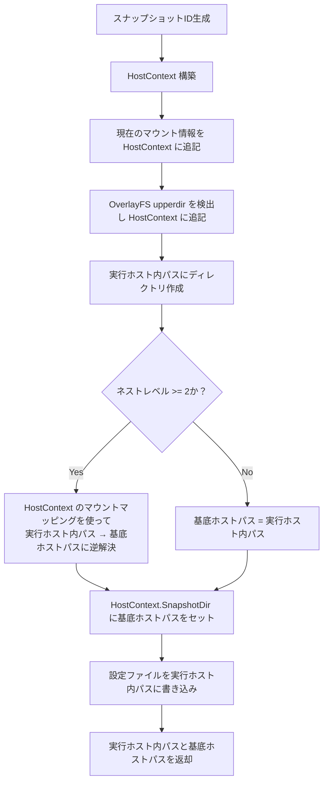

# Feature: Nested Execution (Recursive Execution)

`cderun` は、自身が作成したコンテナ内で自分自身を実行することをサポートしています。これを「Nested Execution（ネスト実行）」または「Recursive Execution（再帰実行）」と呼びます。

## 用語定義

### Base Host (基底ホスト)

最初の `cderun` が実行された物理マシンまたはVM。コンテナランタイム（Docker/Podman）が実際に動作している場所です。

### Execution Host (実行ホスト)

現在の `cderun` コマンドが実行されている環境。基底ホスト、またはコンテナのいずれかになります。

### Nested Level (ネストレベル)

実行の深さ。

- レベル 0: 基底ホスト
- レベル 1: レベル 0 から起動されたコンテナ
- レベル 2: レベル 1 から起動されたコンテナ、といった具合に続きます。

## 仕組み

ネスト実行は、主に以下の3つの機能に基づいています。

1. **バイナリマウント (`--mount-cderun`, `--mount-cderun-path`, `--mount-tools`, `--mount-all-tools`)**: 基底ホストの `cderun` バイナリがコンテナ内にマウントされます（通常は `/usr/local/bin/cderun`）。`--mount-cderun-path` を使用することで、マウントするホスト側のバイナリを明示的に指定できます。
   - **自動有効化**: `--mount-tools` または `--mount-all-tools` を使用する場合、`--mount-cderun` は自動的に有効になります。
2. **ソケットマウント (`--mount-socket`)**: コンテナランタイムのソケット（例: `/var/run/docker.sock`）がコンテナ内にマウントされ、コンテナ内の `cderun` が基底ホスト上の Docker/Podman デーモンと通信できるようになります。
   - **自動有効化**: `--mount-cderun`（自動有効化されたものを含む）が有効な場合、`--mount-socket` は自動的に有効になります（明示的に `false` が指定されている場合を除く）。
3. **コンテキスト伝播 (スナップショット)**: ネスト実行が有効な状態でコンテナが開始されると（上記マウントフラグのいずれかが有効、または既にネスト環境である場合）、`cderun` は現在の設定とホストコンテキストの「スナップショット」を作成し、コンテナ内にマウントします。

## コンテキスト伝播とスナップショット

`cderun` がネスト呼び出しを行う可能性のあるコンテナを起動する際、スナップショットディレクトリを生成し、コンテナ内の `/run/cderun/` にマウントします。

### スナップショット作成の処理順序

スナップショット作成では、「ファイルの書き込み先パス（実行ホスト内パス）」と、コンテナ起動時にマウントの `source` として渡す「基底ホスト上のパス（ホストパス）」を明確に区別します。



**ポイント**:

- **OverlayFS upperdir 検出**: ディレクトリ作成より前に行います。逆パス解決のマッピング情報として使用するためです。
- **逆パス解決の適用**: レベル 2 以上のコンテナを（コンテナ内から）作成する場合、そのスナップショットディレクトリ自体のパスも基底ホストのパスに翻訳してマウント設定に渡す必要があります。実行ホストが基底ホスト（レベル 0）の場合、パスの翻訳は行われません。

**戻り値の使い分け**:

- コンテナ内パス: ファイルの書き込み・クリーンアップ（`RemoveAll`）に使用
- ホストパス: コンテナランタイムへのマウント `source` に使用（コンテナランタイムデーモンは基底ホスト上で動作しているため）

### セキュリティと権限

マルチユーザー環境での情報露出を防ぐため、スナップショットディレクトリおよびその中の設定ファイルには厳格なアクセス権限が設定されます。

- **スナップショットディレクトリ**: `0700` (所有者のみ読み書き実行可能)
- **設定ファイル (.cderun.yaml, .tools.yaml)**: `0600` (所有者のみ読み書き可能)

### スナップショットの内容

このスナップショットには以下が含まれます：

- `.cderun.yaml`: 実行ホストからマージされたグローバル設定。
- `.tools.yaml`: 実行ホストからマージされたツール設定。
- **Host Context (ホストコンテキスト)**: ネストされた `cderun` が基底ホストとの関係を理解するためのメタデータ。

### ホストコンテキスト (`hostContext`)

スナップショット内の `.cderun.yaml` には `hostContext` セクションが含まれます：

```yaml
hostContext:
  binPath: "/usr/local/bin/cderun"          # 基底ホスト上のバイナリ位置
  snapshotDir: "/tmp/cderun-snap-xxxx"     # 基底ホスト上のスナップショットディレクトリ位置
  workingDir: "/home/user/project"         # 現在のカレントワーキングディレクトリのホスト側パス
  level: 1                                 # 現在のネストレベル
  mounts:                                  # 基底ホストパスと現在のコンテナパスのマッピング
    - source: "/home/user/project"
      target: "/app"
      level: 1
```

## ホストパス追跡 (逆パス解決)

コンテナランタイムデーモンは基底ホスト上で動作しているため、デーモンに渡すマウントの `source` パスは基底ホスト上に存在するパスである必要があります。

`cderun` がコンテナ内（レベル >= 1）で実行されており、ディレクトリをマウントしたい場合（例: `--mount .:/src`）、コンテナローカルのパス（`/app`）を基底ホストのパス（`/home/user/project`）に翻訳する必要があります。これを **「逆パス解決 (Reverse Path Resolution)」** と呼びます。

### 解決ロジック

1. **実行環境の判定**: 現在の `cderun` がコンテナ内（ネストレベル 2 以上）で実行されているかを確認します。基底ホスト（レベル 0）およびレベル 1 のコンテナでは、パスはそのままコンテナランタイムに渡されるため、逆解決は行われません。
2. **パスの絶対化**: 要求されたパス（例: `./src`, `~/data`, `/app/src`）を、現在の環境における絶対パスに解決します（例: `/app/src`）。
3. **マッピングの検索**: `hostContext.mounts` を検索し、解決した絶対パスのプレフィックスとして最もよく一致する `target` を探します。

4. **一致の優先順位**:
    - **最長一致（Longest Match）**: より長い `target` パスが優先されます（例: `/tmp` への一致は `/` への一致より優先される）。これにより、OverlayFS によるルートマッピングよりも明示的なボリュームマウントが優先されます。
    - **最新レベル（Deepest Level）**: ターゲットパスの長さが同じ場合、より高い `level`（より深いネストで追加されたマッピング）が優先されます。

5. 一致した `target` プレフィックスを、対応する `source`（基底ホスト上のパス）に置き換えます。

このロジックにより、ネストされたコンテナが「自分の外側」の世界を知らなくても、基底ホスト上の正しいリソースを指し示すことが可能になります。

### 具体的な解決例

以下のシナリオを想定します：

1. **レベル 0 (ホスト)**: `cderun --mount .:/app node` を実行
   - ホストパス: `/home/user/project`
   - コンテナパス (L1): `/app`
2. **レベル 1 (コンテナ)**: コンテナ内で `cderun --mount ./src:/src go build` を実行
   - 要求されたパス: `./src`
   - コンテナ内絶対パス (L1): `/app/src`
   - **逆解決プロセス**:
     - `hostContext.mounts` に `/app` -> `/home/user/project` のマッピングが存在
     - `/app/src` のプレフィックス `/app` が一致
     - 結果のホストパス: `/home/user/project/src`
3. **ランタイム呼び出し**: 基底ホストの Docker デーモンに対し、`source: /home/user/project/src, target: /src` のマウントを指示

これにより、ネストされたコンテナ間でも一貫したファイルアクセスが可能になります。

## 自動ルート検出 (OverlayFS)

`cderun` が OverlayFS ルートファイルシステムを持つコンテナ内で実行されていることを検出した場合、`/proc/self/mountinfo` を解析してホスト側の `upperdir` を自動的に発見します。そして、`hostContext` に `/` のベースマッピング（`source: upperdir, target: /`）を追加します。

### OverlayFS 検出のメリット

明示的にマウントされたボリューム（例: `/app`）以外の場所にあるファイルも、ネストされたコンテナにマウントできるようになります。

**例:**

1. `cderun --mount-cderun alpine` を実行（特定のソースマウントなし）。
2. コンテナ内で `touch /tmp/hello.txt` を実行。
3. さらにコンテナ内で `cderun --mount /tmp/hello.txt:/hello.txt alpine cat /hello.txt` を実行。

このとき、`/tmp/hello.txt` はボリュームではないため通常の逆解決では失敗しますが、OverlayFS 検出により `/` がホストの `upperdir`（例: `/var/lib/docker/overlay2/.../diff`）にマップされているため、正しくホストパスへ変換されます。
詳細な仕様については [proc-self-mountinfo 仕様書](../references/proc-self-mountinfo.md) を参照してください。

## 設定発見の優先順位

コンテナ内では、`cderun` は以下の順序で設定ファイルを検索します（上が最高優先度）：

1. **P1: cderun内部オーバーライド** (`--cderun-*` フラグ)
2. **P2: コマンドライン引数**
3. **P3: 環境変数**
4. **P4: ツール固有設定** (`.tools.yaml`)
   - カレントディレクトリから親へ遡って検索
   - `~/.config/cderun/.tools.yaml`
   - `/etc/cderun/.tools.yaml`
   - **/run/cderun/.tools.yaml** (ネスト注入された設定)
5. **P5: cderunデフォルト設定** (`.cderun.yaml`)
   - カレントディレクトリから親へ遡って検索
   - `~/.config/cderun/.cderun.yaml`
   - `/etc/cderun/.cderun.yaml`
   - **/run/cderun/.cderun.yaml** (ネスト注入された設定)
6. **P6: ハードコードされたデフォルト値**

※ `/run/cderun/` は「真のデフォルト」として機能し、ユーザーがコンテナ内で明示的に用意した設定ファイルがある場合はそちらが優先されます。

## ライフサイクル管理

- **作成**: `--mount-cderun`, `--mount-tools`, `--mount-all-tools` のいずれかを伴う実行（設定ファイルでの指定を含む）、または既にネストレベルが 1 以上の環境での実行において、コンテナ起動プロセスの途中で生成されます。
- **削除**: コンテナが終了（または `cderun` プロセスが終了）した際に、実行ホスト上のコンテナ内パス（`/tmp/cderun-snap-<uuid>/`）を再帰的に削除します。

## 課題と制限事項

- **ファイルシステムの可視性**: 基底ホストから現在のコンテナに既にマウントされているパスのみが、ネストされたコンテナに正常にマウントできます。
- **ソケットの権限**: コンテナ内のユーザーは、マウントされたコンテナランタイムソケットにアクセスする権限を持っている必要があります。
- **クリーンアップ**: `cderun` は終了時にスナップショットをクリーンアップしようとしますが、予期せぬ中断によって孤立したファイルが残る可能性があります。
- **UUIDの衝突**: 非常に低い確率ですが、UUIDの衝突を避けるための実装（リトライ等）が推奨されます。
- **環境変数の非継承**: 実行ホスト（コンテナ）内で設定した環境変数は、ネストされたコンテナには引き継がれません。明示的に `--env` で指定する必要があります。
- **プラットフォーム依存**: `cderun` バイナリは実行ホストと同じアーキテクチャである必要があります。静的リンクされたバイナリが推奨されます。
- **`{{HOME}}` / `{{PWD}}` の展開**: ネスト実行環境（コンテナ内）では `{{HOME}}` や `{{PWD}}` はコンテナ内の値に展開されます。基底ホストのパスを参照したい場合は `{{BASE_HOME}}` と `{{BASE_PWD}}` を使用してください。詳細は [Value Resolution](value-resolution.md) を参照してください。

## セキュリティ考慮事項

- **ランタイムソケットへのアクセス**: `--mount-socket` により、コンテナ内から基底ホストのコンテナランタイムへの完全アクセスが可能になります。コンテナエスケープのリスクがあるため、信頼できる環境でのみ使用してください。
- **cderun バイナリ**: read-only でマウントされます。
